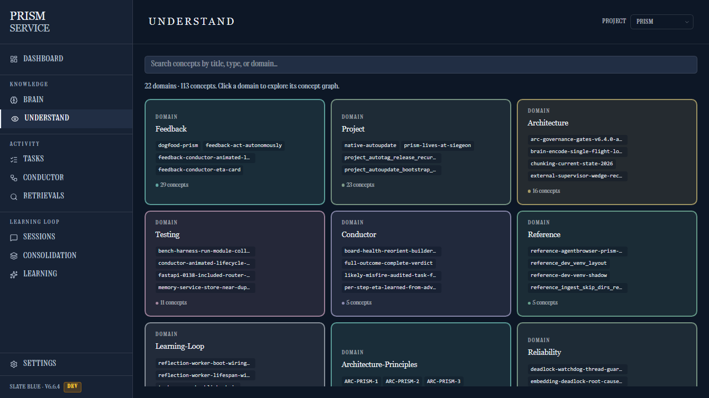

<!-- PRISM repository index. Agent-first: this is the page an AI agent reads
     to install PRISM, wire up its MCP, and start working tasks. Keep the
     version line in sync with prism_service/__version__.py on each release. -->

<div align="center">

# PRISM

**An on-prem memory + knowledge layer and conductor for AI coding agents — over MCP.**

Durable project memory, a navigable knowledge wiki, a code graph, and a gated SDLC task conductor — so your agent builds with continuity instead of starting cold every session.

[](./services/prism-service/prism_service/__version__.py)
[](https://www.python.org/)
[](#license)
[](https://modelcontextprotocol.io/)

<br/>



<sub><i>PRISM's Understand wiki — your project's knowledge as a navigable graph.</i></sub>

</div>

---

## All you need

**1.** Install (isolated; Python 3.12):

```bash
pipx install prism-service
```

**2.** Start the daemon — web `:7778` · MCP `:7777`:

```bash
prism start --daemon
```

**3.** Connect your agent. Either call the **`prism_onboard`** MCP tool once (it auto-seeds the architecture principles so `plan_gate` passes, and returns the `.mcp.json` wiring, ports, and version) — or add the snippet to your agent's `.mcp.json` by hand:

```json
{ "mcpServers": { "prism": { "type": "http",
  "url": "http://localhost:7777/mcp/?project=<name>" } } }
```

**4.** Call **`prism_guide`** first → live orientation + the task playbook.

> **New here, AI agent?** Install, connect the MCP, then **call `prism_guide` first**.

## What you get

- **Memory** — durable conventions, decisions, and failures with importance/decay, recalled into context so the agent stops repeating mistakes.
- **Knowledge wiki** — one interconnected **OKF / Understand** wiki over your curated memory: a concept graph you click through, with cross-links and backlinks.
- **Code graph** — hybrid retrieval (**vector + BM25**) via `brain_search` / `brain_understand`, over a tree-sitter entity graph you traverse directly with `brain_call_chain`. <sup>[†](#graph-leg)</sup>
- **Gated conductor** — a hierarchical SDLC state machine: **epics → demonstrable-feature subtasks** with proof-carrying gates and epic → subtask fan-out.

## Benchmarks

Same harness, **LongMemEval R@5** (recall@5 — did the gold memory land in the top-5):

| Stack | R@5 | Scope |
|---|---|---|
| vanilla single-vector RAG **baseline** (potion-base-32M) | **0.524** | full 500 Q |
| PRISM's shipped multi-granular hybrid stack | **0.900** | 120-Q stratified (pool@50 = 0.900) |

So a vanilla setup scores ~0.52; PRISM's retrieval pipeline lifts that to **0.90**. That number is what the **defaults** score — nothing to switch on, no environment variables. It replaces an earlier "0.94–0.98" claim that was a 50-question smoke and credited a query-decomposition stage that shipped *disabled*; measured properly, that stage did not help and has been removed (task 19e4e7f7, see `benchmarks/EXPERIMENTS.md`). PRISM does **not yet** claim to beat the best public coding agents (SWE-bench Verified etc. are not yet officially scored).

Every number on this page is produced by a runner in this repo, and you can
re-run it: memory retrieval with [`benchmarks/longmemeval/run.py`](./benchmarks/longmemeval/run.py),
code retrieval with [`benchmarks/graft_parity/ab_retrieval.py`](./benchmarks/graft_parity/ab_retrieval.py),
and the claim policy that blocks unproven claims with [`benchmarks/status/run.py`](./benchmarks/status/run.py).
Full table, the cross-system landscape, and caveats below.

---

<details>
<summary><b>Benchmarks — full table, cross-system landscape & caveats</b></summary>

Real, reproducible numbers. Sources: [`benchmarks/EXPERIMENTS.md`](./benchmarks/EXPERIMENTS.md) (the append-only Brain-retrieval log) and [`benchmarks/README.md`](./benchmarks/README.md) (the claim policy).

**Memory retrieval — LongMemEval R@5** (CPU-only, one harness). Every row names
its **N**, because they are not all the same size: a 50-question smoke is not
comparable to a full 500-question run, and treating them as one ladder is how
the old "0.98" claim survived as long as it did.

| Stack | R@5 | N | Status |
|---|---|---|---|
| vanilla single-vector RAG baseline (potion-base-32M) | **0.524** | 500 | baseline |
| swap embedder → all-MiniLM-L6-v2 (22M params) | **0.634** | 500 | shipped |
| + multi-granular chunking + contextual prefix | 0.940 | **50** | smoke only |
| **PRISM's shipped defaults, measured properly** | **0.900** | **120** | **what you install** |
| ~~+ rules-based query decomposition~~ | ~~0.980~~ | ~~50~~ | **RETIRED — see below** |

The 0.900 row is the honest headline: shipped defaults, no environment
variables, 120 stratified questions.

**Why the 0.980 row is struck through.** `PRISM_QUERY_DECOMP` shipped defaulting
to *off*, so no installed user ever ran it — and the number crediting it was a
50-question smoke, meaning the `+0.040` lift was **2 questions**. Task 19e4e7f7
measured it on three independent corpora and it never won: PocketBase code
search n=115 **−0.0014** (p=1.0), FullStackHero n=119 **+0.0042** (p=1.0),
LongMemEval n=120 **−0.0167** (p=0.7266) — the fair test, since 66% of those
questions actually decomposed against 21% of commit subjects — at **2.2× the
latency**. The mechanism was the giveaway: with no connective present it blindly
split any query over 12 tokens at the midpoint. It has been **removed from the
code**, not merely defaulted off.

<a name="graph-leg"></a>**† Why retrieval is billed as vector + BM25, not "+ graph".** `brain_search`
fuses three candidate lists with RRF, and the third — the graph leg — currently
contributes **nothing to result order**. Its ids are file paths while the other
two legs emit `<source_file>::<entity>`, and RRF fuses on that id, so the lists
can never reinforce each other: **0 of 437** graph ids match a `docs.id` on
PocketBase, **1 of 563** on this repo's own index. Building a 3,628-entity /
13,561-edge graph left every result rank byte-identical. The obvious fix was
built and measured, and it is **worse** — it loses at every cut-off on all three
corpora (pooled McNemar 66–38 favouring what ships, **p=0.0078**), because the
leg matches entity names with `LIKE '%token%'` and floods the fusion with noise.
So the graph is real and directly useful through `brain_call_chain`; it is just
not doing ranking work today, and the front page will not say it is until it
does. Tracked as task 763ee039.

**Context assembly** — the `contextpack` benchmark scores **1.000** across every dimension (persona frame, Brain/Memory/Task recall, no-noise/leakage, deterministic asset digests).

**Meta-conductor prompt-promotion** — decision_accuracy **1.000** with **0** false promotions (no-LLM candidate generation + holdout-gated promotion).

**Cross-system landscape (on LongMemEval).** Where PRISM's retrieval sits among other self-reported memory systems:

| System | Metric | Score | Source |
|---|---|---|---|
| **PRISM** | recall@5 | **0.900** (120-Q stratified, shipped defaults; 0.634 at full 500 Q w/ MiniLM) | [`benchmarks/EXPERIMENTS.md`](./benchmarks/EXPERIMENTS.md) |
| vanilla single-vector RAG (baseline) | recall@5 | 0.524 (500 Q) | [`benchmarks/EXPERIMENTS.md`](./benchmarks/EXPERIMENTS.md) |
| MemPalace | recall_any@5 | ~96.6% | [mempalace.tech/benchmarks](https://www.mempalace.tech/benchmarks) |
| Mastra OM | LongMemEval acc | ~94.9% | [agentmarketcap landscape 2026](https://agentmarketcap.ai/blog/2026/04/10/agent-memory-vendor-landscape-2026-letta-zep-mem0-langmem) |
| Hindsight | LongMemEval acc | ~91.4% | [agentmarketcap landscape 2026](https://agentmarketcap.ai/blog/2026/04/10/agent-memory-vendor-landscape-2026-letta-zep-mem0-langmem) |
| Letta | LongMemEval acc | ~83% | [atlan: agent memory frameworks 2026](https://atlan.com/know/best-ai-agent-memory-frameworks-2026/) |
| Zep (Graphiti) | temporal subset (GPT-4o) | ~63.8% | [atlan: agent memory frameworks 2026](https://atlan.com/know/best-ai-agent-memory-frameworks-2026/) |
| Mem0 | temporal subset (GPT-4o) | ~49% (up to ~93% w/ newer algo) | [mem0: state of AI agent memory 2026](https://mem0.ai/blog/state-of-ai-agent-memory-2026) |

Self-reported on LongMemEval; metrics and LLMs vary (recall@5 ≠ end-to-end QA accuracy), so read this as a landscape, not a leaderboard. PRISM's recall@5 (did the gold memory appear in top-5) is **directional** only against the QA-accuracy figures most systems report — we do **not** present a "PRISM beats X" ranking.

**Scope caveat.** Our headline **0.900** is a **120-question stratified** run on shipped defaults; the full-500-Q run of that stack is **pending**. Separately, code retrieval is much weaker than memory retrieval: on real commits, `r@5` sits at **0.28–0.52** depending on the repo (PocketBase 0.522, FullStackHero 0.466, Jellyfin 0.283 — `benchmarks/graft_parity/ab_retrieval.py`, 739 cases across 3 repos and 2 languages). Do not read the memory number as a code-search number. The tracked competitive coding-agent bars — **SWE-bench Verified**, **SWE-rebench**, **Terminal-Bench 2.0**, **BFCL V4** — are **not yet officially scored**, so public-best claims are blocked. The decisive next step is a paired **SWE-bench Lite** PRISM-on/off **proof campaign** (current local smoke is 1/2 vs 1/2 — too small to claim an advantage). Reproduce the numbers via `benchmarks/longmemeval/run.py` and `benchmarks/status/run.py`.

</details>

<details>
<summary><b>Working tasks the PRISM way (max fan-out + the MCP toolkit)</b></summary>

After install, from the agent: **call `prism_onboard` first** (one call seeds the default architecture principles so `plan_gate` is satisfiable, and returns the `.mcp.json` snippet, ports, version, and a `prism_guide` pointer). Then **call `prism_guide`** for the live orientation + the *"Working tasks the PRISM way"* playbook.

> Create an **epic** as a root task (tracked live on the conductor) → break it into demonstrable-feature **subtasks** → run independent subtasks **IN PARALLEL via subagents** → a **distinct-actor** subagent clears each red/green gate with real artifacts (no self-override, proof-carrying) → `principles_seed` so `plan_gate` passes → **roll the child proofs up** to the epic's `green_gate` → write the **why** back to memory at `green_gate` → browse what you know via the **OKF / Understand wiki** (`okf_index` / `okf_get` / `okf_graph`, `brain_understand`). Prefer the `implement` (build) and `prototype` (plan) workflows.

Core MCP tools: `prism_onboard`, `prism_guide`, `brain_search` / `brain_understand` / `brain_call_chain`, `okf_index` / `okf_get` / `okf_graph` (the Understand wiki), `principles_seed`, `memory_store` / `memory_recall`, `task_create` / `task_update` / `task_next`, and `conductor_work` — the single loop verb that drives the SDLC (it superseded `conductor_advance` / `conductor_gate` / `workflow_state`, which remain reachable via `tool_profile=all` for admin and debug).

</details>

<details>
<summary><b>Install, ports, Web UI & run from source</b></summary>

**Native install** — PRISM is a pip/pipx package, `prism-service` (Python 3.12):

```bash
pipx install prism-service                    # isolated; recommended
prism start --daemon                          # web → :7778 · MCP → :7777
prism status                                  # confirm it's up
prism logs --follow                           # tail logs
curl http://localhost:7778/api/version        # → {"version": "6.7.4", ...}
```

Lifecycle: `prism start [--daemon]` · `prism status` · `prism logs` · `prism stop` · `prism update` · `prism version`.

**Web UI** — `http://localhost:7778/` — a React SPA: **Dashboard · Brain (graph) · Understand (wiki) · Tasks · Conductor · Sessions · Consolidation · Learning**. The footer shows the build + theme (e.g. *Slate Blue · v6.7.4*).

**Run from source (contributors):**

```bash
git clone https://github.com/siegeon/.prism && cd .prism
python -m venv .venv && . .venv/Scripts/activate           # 3.12
pip install -e services/prism-service
prism start --daemon
# SPA dev (HMR): cd services/prism-service/prism_service/web && npm install && npm run dev
```

See [`CLAUDE.md`](./CLAUDE.md) for repo conventions and layout, and the MCP `prism_guide` tool for the live agent playbook.

</details>

<details>
<summary><b>Status & license</b></summary>

Active development — `prism_service/__version__.py` is the canonical version + changelog (`PRISM_VERSION_NOTES`). Current: **v6.7.4** (clean quickstart numbering, cross-system comparison table, Understand-wiki hero screenshot).

<a name="license"></a>**License:** Apache-2.0.

</details>
