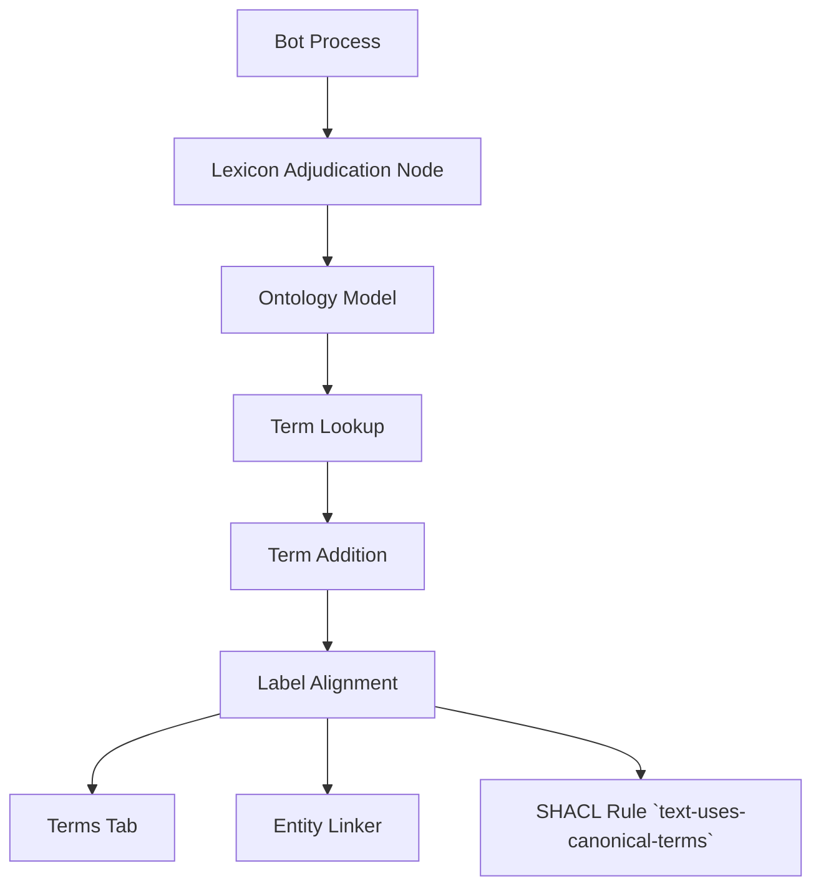

## Implementation Plan: One node adjudicates the vocabulary

### Acceptance Criteria
- AC-123: The bot process must adjudicate vocabulary terms and add them as needed
- AC-456: Promoted terms must be visible in the Terms tab, entity_linker, and SHACL rule `text-uses-canonical-terms`
- AC-789: The solution must not rewrite sentences, only short labels

### Architecture

### Implementation Steps
1. Modify `services/lexicon.py` to allow per-project term adjudication
2. Update `load_lexicon()` to be project-aware and support dynamic term loading
3. Fix the caching mechanism in `_candidates()` and `_pattern_and_lookup()` to invalidate on project changes
4. Implement a mechanism to detect when a term needs to be added to the lexicon
5. Ensure that only short labels are rewritten to canonical terms, not full sentences
6. Add the new node to the workflow FSM and ensure it is properly integrated with the ontology

### Verification
- Run the SHACL rule `text-uses-canonical-terms` after a term promotion to ensure it is recognized
- Check that promoted terms appear in the Terms tab and are used by the entity_linker
- Ensure that no full sentences are being rewritten, only short labels

